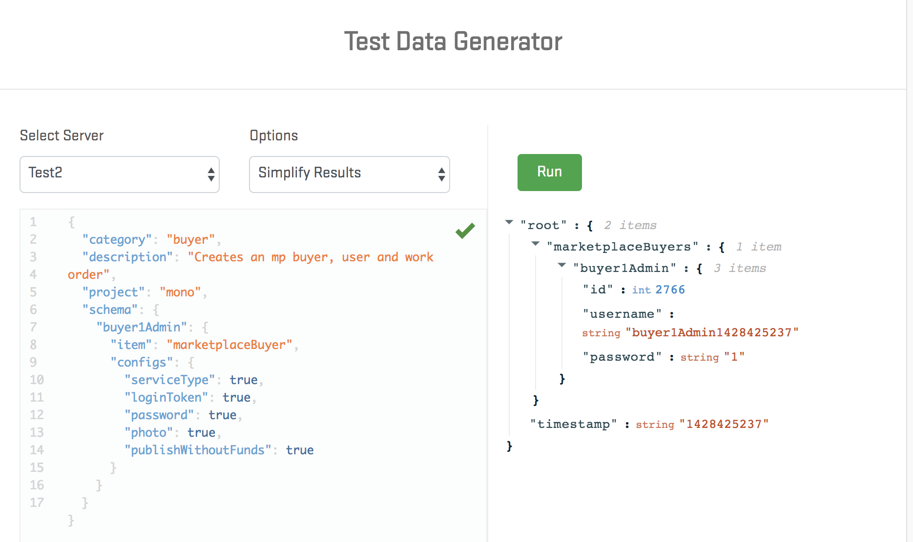

+++
author = "Tim Mader-Brown"
comments = true
date = "2019-03-06"
draft = false
image = "images/bug.png"
menu = ""
share = true
slug = "making-test-data"
tags = ["Field Nation", "QA Automation Architect", "test automation"]
title = "Making Test Data"

+++

# Making Test Data

Hello World!

Today, I bring the Field Nation blog back to life after a 2+ year coma. What's the topic for this sudden revival?  One of my very favorite topics…. creating test data.

What does a tent sitting in the middle of the tundra have to do with creating test data? This illustrates a very important point in regards to testing.  If someone were to test this tent, they would set it up in different climates, at different times of the year, and maybe using some different add-ons for the tent. For example, they might test a “wind shield” feature in northern Minnesota, from January 1-5.  The tester would bring the supplies to that site, set up the tent and report their findings.  It's not likely that the tester would be manufacturing the tent from scratch, the prerequisite for the testing is that a tent is available for testing, and ready o use.

Our software tests should be no different.  I've seen it time and time again where a test case will run through a handful of tasks, create a user, update that users profile, put the user into some sort of group, and after all that is done then the test will begin.  When the tests are executed manually this can be especially painful because humans have a tendency to be inconsistent with their approach. Not to mention, it’s borderline torture to repeat the same tasks like this over and over and over and… you get my point.

We solved this problem at Field Nation using a project that we call the Test Data Generator.  Rather than having a manual test or an automated test click through all the pre-conditions needed to complete the test, we can make a single call to the test-data-generator that will create all of that data needed to execute the test.

Here’s another example, let's say Facebook wants to test whether a user can join a Facebook Group.  They would have their version of a test-data-generator begin by running something that would generate a brand new user. This could be by directly interacting with the database or via an API. Then, after the user is created, they could use that user in an integration test and go through the motions of adding the user to the group and checking that it was successfully added to the group. Using this approach makes our tests shorter, faster, more consistant and easier to pinpoint where the bug is located.  

One last note, since we created a web service for the test-data-generator, we thought "Hey, maybe if we made a UI for this then other people, like support or even sales could use it".  So we created a UI for it that looks like this…

This is all very new at Field Nation, so I'll report back more findings as they come up.
